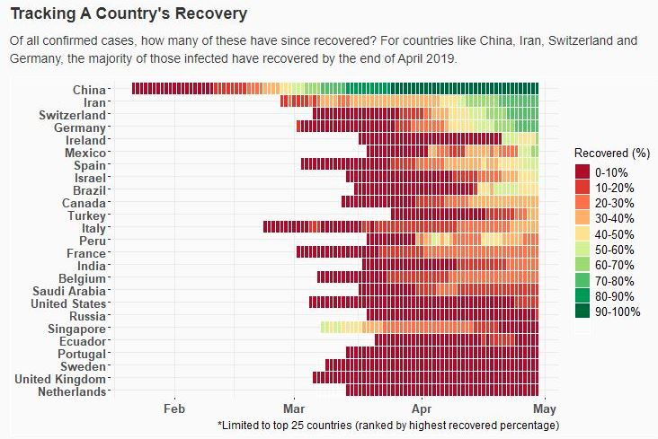

# COVID-19: Data Viz in R (ggplot2) & Shiny

There's a misconception within the data community that R is only good for statistical analysis. And yes, R is great for that, but it can produce some pretty stunning data visualizations too! Here I present an interactive dashboard for the early spread of COVID-19<sup>\*</sup>.

<p align="center">
  
</p>

R is also pretty great at custom static visualizations. By _custom_ I mean not a bar chart (or a pie chart - which you should never use).

<p align="center">
  
</p>

Here's another popular visualization you might have already seen online. To most everyone it's just a gif, but you can call it a dynamic visualization if you want to sound fancy.

<p align="center">
  
</p>

<em><sup>\*</sup>This visualisations presented here are meant for illustrative purposes only, and the data pertaining to COVID-19 is not up-to-date. The last update was on the 29<sup>th</sup> of April.</em>

## Background

Ask any data scientist and they'll tend to agree, there is a recipe to studying data, and it's this:

1. Clean
2. Visualize
3. Analyze (or model)
4. Productionalise (or share)
5. Monitor (and update)

There are some T&Cs. You can swap the order of points 2. and 3. or even combine them (ever heard of EDA?). You might also jump between these points - the analysis of any data is often an iterative process. That said, the above recipe is generally a good starting point.

When it comes to choosing a language or software package it should score pretty high at executing these steps. So what are your options? PowerBI is great for visualizations and shareability. It's pretty bad at data wrangling though (and quite simply horrendous at statistical analysis without applying a great deal of effort). Ditto for Tableau, if you're wondering. Other popular options include [Python](https://www.python.org/)<sup>\*</sup>, or even a combination of MS Excel & Powerpoint. I decided to give [R](https://www.r-project.org/) (and it's IDE, [RStudio](https://www.rstudio.com/)) a go.

1. Clean - I used [dplyr](https://www.rdocumentation.org/packages/dplyr/versions/0.7.8).
2. Visualize - I used [ggplot2](https://www.rdocumentation.org/packages/ggplot2/versions/3.3.5).
3. Analyze (or model) - Again, I used [dplyr](https://www.rdocumentation.org/packages/dplyr/versions/0.7.8).
4. Productionalize (or share) - I used [shiny](https://shiny.rstudio.com/).

(Quick tip: check out the [tidyverse](https://www.tidyverse.org/packages/) package.)

<em><sup>\*</sup>I'm not going to pretend that Python isn't better than R in almost every possible way. For starters, the community is much larger - and this matters. A lot. You'll find more tutorials, more courses. You'll have better luck finding sample code online. You'll have a greater selection of packages to choose from. In fact, Python is so popular it's very likely the company you're at already has Python integrated into their stack, and this makes productionalizing anything you come up with much smoother. </em>

## Installation


<!-- 

1. Clone the [Matterport Mask R-CNN repository](https://github.com/matterport/Mask_RCNN) and follow the installation instructions. You may be required to install additional software.
2. Download the red roman dataset splits `train`, `test` and `val`, available in this respository [here](https://github.com/FishCV/fishcv.github.io/tree/main/dataset/via). These datasets should be placed in the path: `../Mask_RCNN/datasets/redroman/`. (This will be inside the local matterport directory created in 1.)
3. For inference, download `mask_rcnn_redroman.h5` from [here](https://drive.google.com/drive/folders/1ltqEYAN5qIrL1B_SHkg6SYGlIRaUX7-o?usp=sharing). Save in path: `../Mask_RCNN/weights/redroman/`.
4. Download `redroman.py` python script and `pyimagesearch` lib (for training and inference) and `mAP.ipynb` (for model evaluation) from [here](https://github.com/FishCV/fishcv.github.io/tree/main/model). These should be placed in the path: `../Mask_RCNN/samples/redroman/`
5. Setup a Python environment (an Anaconda virtual environment is recommended). Please use the environment file [here](https://github.com/FishCV/fishcv.github.io/tree/main/model) for this purpose.
6. From the console, `cd` into `../Mask_RCNN/samples/redroman/` to execute sample code (see below) for training/ inference.

<p align="center">
  
</p>

## Training

1. Train a new model starting from pre-trained COCO weights  
```
python redroman.py train --dataset=..\..\datasets\redroman\ --weights=coco
```

2. Resume training a model from last trained weights (or select specific weights file)  
```
redroman.py train --dataset=..\..\datasets\redroman\ --weights=last
```
or
``` 
python redroman.py train --dataset=..\..\datasets\redroman\ --weights=..\..\weights\redroman\mask_rcnn_redroman.h5
```

## Inference

1.  **(Image)** Detection (bbox, mask, centroid)
```
python redroman.py detect --weights=..\..\weights\redroman\mask_rcnn_redroman.h5 --image=..\..\datasets\inference\redroman\images
```
(Note: Inference is performed on a folder of images. If you'd like to run the model on a single image, make a separate folder containing this single image.)  

2. **(Video)** Detection (bbox, mask, centroid)
```
python redroman.py detect --weights=..\..\weights\redroman\mask_rcnn_redroman.h5 --video=..\..\datasets\inference\redroman\video\sample_video.MP4
```

3. **(Video with centroid tracking)** Detection (bbox, mask, centroid)
```
python redroman.py detect --weights=..\..\weights\redroman\mask_rcnn_redroman.h5 --video=..\..\datasets\inference\redroman\video\sample_video.MP4 --tracking Y
```

## Model Parameters

There are a number of model parameters that can be tuned during training (see below for some examples). Please see the [Matterport Wiki](https://github.com/matterport/Mask_RCNN/wiki) for help on this.

```python
class FishConfig(Config):
    """
    Configuration for training on your own dataset (red roman dataset).
    Derives from the base Config class and overrides some values.
    """

    # [1]
    BACKBONE = "resnet50"

    # [2]
    IMAGE_MIN_DIM = 460; IMAGE_MAX_DIM = 576

    # [3]
    GPU_COUNT = 1; IMAGES_PER_GPU = 1

    # [4]
    TRAIN_ROIS_PER_IMAGE = 100
    STEPS_PER_EPOCH = 300
    VALIDATION_STEPS = 100
    MAX_GT_INSTANCES = 10
    
```

You can also override some parameters that will apply only when the model is set to inference.

```python
class FishInferenceConfig(FishConfig):
    """
    Configuration for inference on test data (red roman dataset).
    Derives from the FishConfig class (and by extension, Base Config class) and overrides some values.
    """
    
    # [1] e.g. You can increase this during training to generate more propsals.
    RPN_NMS_THRESHOLD = 0.7
```

-->